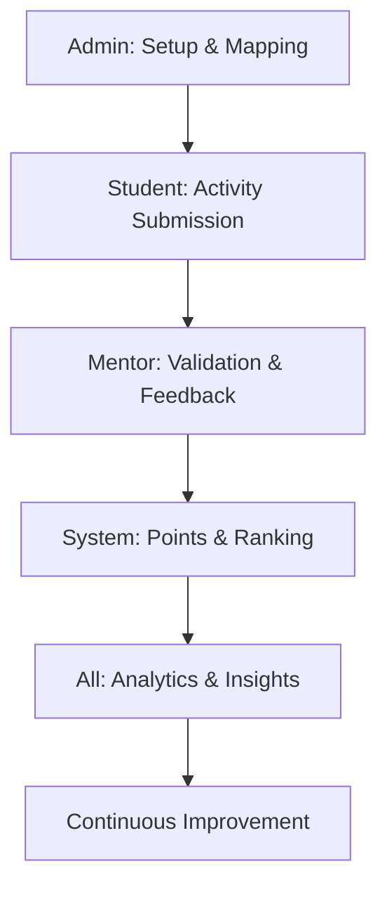

# Progress IQ - Smart Activity Reporting Dashboard

Progress IQ is a modern, comprehensive activity tracking and performance monitoring platform. It streamlines the workflow between students, mentors, and administrators, providing real-time insights and data-driven analytics to enhance institutional productivity.

## 🚀 Project Overview

The system is designed to eliminate manual spreadsheet tracking by providing a centralized workspace for:
- **Daily Activity Logging**: Real-time submission of tasks and projects.
- **Validation Workflow**: Seamless approval process for mentors.
- **Gamified Performance**: Points, rankings, and leaderboards to motivate students.
- **Advanced Analytics**: Visualization of trends and productivity metrics.
- **Institutional Oversight**: Bulk management and reporting for administrators.

---

## 🔄 System Flow



1.  **Setup & Mapping (Admin)**: Administrators configure the system, manage users, and map students to respective mentors.
2.  **Activity Submission (Student)**: Students submit daily tasks, project updates, and certifications through their personalized dashboard.
3.  **Validation & Feedback (Mentor)**: Mentors review submissions, provide feedback, and approve/reject activities.
4.  **Points & Ranking (System)**: The system automatically awards points based on approved activities, updating the real-time leaderboard.
5.  **Analytics & Insights**: stakeholders access visual reports, heatmaps, and performance trends.

---

## 🛠️ Role-Based Functionalities

### 🛡️ Admin Dashboard
*Institutional oversight and system management.*
- **User Management**: Bulk import and management of students and mentors.
- **Student-Mentor Mapping**: Assigning students to specific mentors for guidance.
- **Activity Monitoring**: High-level view of all system activities and logs.
- **Top Rankers View**: Identifying high-performing students across the institution.
- **Reporting**: Generate and download professional PDF/Excel reports.
- **System Analytics**: Institutional-level performance metrics and trends.

### 💼 Mentor Dashboard
*Student guidance and submission validation.*
- **Student Monitoring**: Track the progress of assigned students in real-time.
- **Approval Workflow**: Review and validate student submissions (Tasks, Projects, Certifications).
- **Feedback System**: Provide direct feedback on student work.
- **Points Allocation**: Managed scoring based on submission quality.
- **Internship Tracking**: Monitor student internship progress and documentation.
- **Surveys & Feedback**: Conduct student surveys and collect institutional feedback.

### 🎓 Student Dashboard
*Personal activity tracking and progress monitoring.*
- **Activity Logging**: Daily task submission and project updates.
- **Certification Vault**: Upload and manage professional certifications.
- **Internship Management**: Log internship details and track professional growth.
- **Performance Analytics**: Personal activity heatmaps and progress charts.
- **Leaderboard**: Rank tracking and competitive performance metrics.
- **Notifications**: Stay updated on mentor feedback and system announcements.

---

## 💻 Tech Stack

- **Framework**: [Next.js 15+ (App Router)](https://nextjs.org/)
- **Language**: [TypeScript](https://www.typescriptlang.org/)
- **Styling**: [Tailwind CSS 4](https://tailwindcss.com/)
- **Animations**: [Framer Motion](https://www.framer.com/motion/)
- **Icons**: [Lucide React](https://lucide.dev/)
- **State Management**: [Zustand](https://github.com/pmndrs/zustand)
- **UI Components**: [Radix UI](https://www.radix-ui.com/) & [Shadcn UI](https://ui.shadcn.com/)
- **Charts & Data Viz**: [Recharts](https://recharts.org/), [Globe.gl](https://globe.gl/), [Three.js](https://threejs.org/)
- **Export Tools**: [XLSX](https://github.com/SheetJS/sheetjs) for Excel reporting

---

## 🚦 Getting Started

### Prerequisites

- Node.js (Latest LTS recommended)
- npm / yarn / pnpm

### Installation

1. Clone the repository
2. Navigate to the Frontend directory:
   ```bash
   cd ProgressIQ/Frontend
   ```
3. Install dependencies:
   ```bash
   npm install
   ```
4. Configure environment variables (copy `.env.example` to `.env`)
5. Run the development server:
   ```bash
   npm run dev
   ```

Open [http://localhost:3000](http://localhost:3000) with your browser to see the result.

---

## 📁 Project Structure

```text
src/
├── app/               # Next.js App Router (Routes & Layouts)
│   ├── (public)/      # Landing, Sign-in, Sign-up
│   └── (private)/     # Role-based Dashboards (Admin, Mentor, Student)
├── components/        # Reusable UI Components
├── hooks/             # Custom React Hooks
├── lib/               # Shared Utilities & Configurations
├── store/             # Global State (Zustand)
└── utils/             # Helper Functions
```
